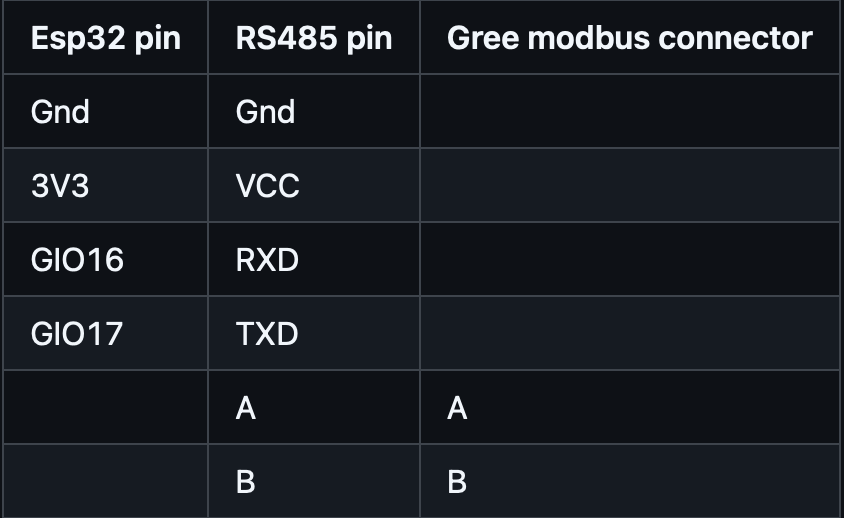

# GREE FHBQ-3,5-D: Управление системой вентиляции через ESPHome

Проект предназначен для управления системой вентиляции GREE FHBQ-3,5-D с использованием модуля ESP32 и интеграции с Home Assistant.

## Описание

Этот проект реализует управление вентиляционной системой через интерфейс Modbus с использованием ESP32, настроенного через ESPHome. Проект поддерживает управление такими параметрами, как:
- Скорость вентилятора
- Режим работы вентиляции
- Текущая влажность
- Режимы питания


## Основные компоненты

1. **Модуль ESP32**  
   Используется для подключения к системе через RS485-интерфейс.
   

2. **TTL-RS485 конвертер**  
   Преобразует сигналы UART в RS485.
   

3. **DIP-переключатели**  
   Настройка Modbus-адреса устройства (к установленному значению добавляем 1).  
   

4. **Подключение через COM-BMS**  
   Используется для подключения RS485 к вентиляционной системе.  
   
   
5. **Подключение **    
   
## Установка

1. **Подключение оборудования**:
   - Подключите модуль ESP32 к TTL-RS485 модулю.
   - Подключите RS485 к интерфейсу системы вентиляции через разъёмы COM-BMS1 или COM-BMS2.

2. **Конфигурация ESPHome**:
   - Установите ESPHome и настройте YAML-файл:
     ```yaml
     substitutions:
       device_name: "GREE FHBQ-3,5-D"
     ```
     Полный файл конфигурации можно найти в файле `gree-fhbq-35.yaml`.

3. **Загрузка прошивки**:
   - Перенесите YAML-файл на ESP32 через ESPHome.

4. **Интеграция с Home Assistant**:
   - Добавьте ESPHome-устройство в Home Assistant.
   - Настройте параметры через интерфейс Home Assistant.

## Интерфейс Home Assistant

Интерфейс включает:
- Управление питанием (ON/OFF)
- Выбор режима работы вентилятора (Supply, Exhaust и т.д.)
- Уровень влажности в помещении.

## Особая благодарность
"ОФИЦИАЛЬНЫЙ ДИСТРИБЬЮТОР GREE В УКРАИНЕ" [https://gree.com.ua](https://gree.com.ua/)
